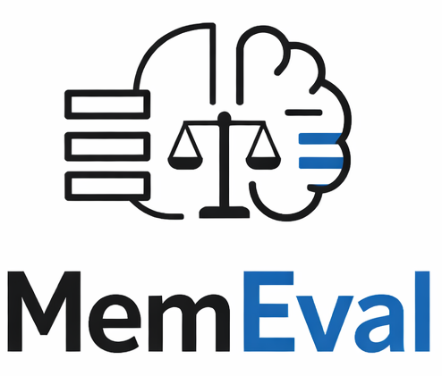
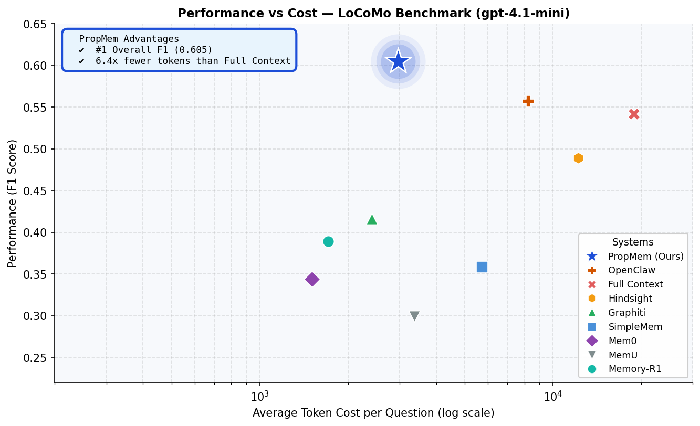

<p align="center">
  
  <br/>
  <em>Semantic memory for agent platforms — what the agent knows about the user</em>
  <br/><br/>
  <a href="LICENSE"></a>
  
  <a href="https://github.com/ProsusAI/MemEval"></a>
  <a href="https://github.com/ProsusAI/MemEval/pulls"></a>
</p>

<p align="center">
  
</p>

*#1 overall F1 on LoCoMo — 7x fewer tokens than full context. See [MEMCLAW.md](MEMCLAW.md) for the design.*

---

## 📑 Table of Contents

- [🌟 Results](#-results)
- [💡 Examples](#-examples)
- [🔬 How It Works](#-how-it-works)
- [🚀 Quick Start](#-quick-start)
- [🛠️ Add Your System](#️-add-your-system)
- [⚖️ Fairness Notes](#️-fairness-notes)
- [📝 References](#-references)

---

## 🌟 Results

[LoCoMo](https://arxiv.org/abs/2402.17753) evaluates long-term memory using realistic multi-session dialogues (1,986 QA pairs across 10 conversations). Categories: factual (36%), adversarial (25%), temporal (21%), multi-hop (15%), inferential (4%).

All results with **gpt-4.1-mini**, **text-embedding-3-small**, token-level F1 scoring. Token counts include both ingestion and query — tracked via monkey-patching the OpenAI SDK.

| System | Overall | Factual | Temporal | Multi-hop | Adversarial | Tokens |
|--------|---------|---------|----------|-----------|-------------|--------|
| **MemClaw** | **0.556 ± 0.037** | 0.379 | 0.506 | 0.540 | **0.812** | **5.3M** |
| Full Context | 0.545 ± 0.036 | **0.517** | 0.380 | **0.675** | 0.504 | 37.5M |
| SimpleMem | 0.470 ± 0.043 | 0.393 | **0.583** | 0.555 | 0.299 | 22.5M |
| Graphiti | 0.415 ± 0.031 | 0.279 | 0.135 | 0.367 | **0.875** | 0.7M |
| Mem0 | 0.345 ± 0.037 | 0.279 | 0.121 | 0.344 | 0.595 | 3.0M |
| MemU | 0.310 ± 0.028 | 0.192 | 0.064 | 0.235 | 0.760 | 6.9M |
| OpenClaw | 0.277 ± 0.028 | 0.230 | 0.069 | 0.120 | 0.790 | 16.5M |

**Key Advantages:**
 - **#1 Overall F1** — best cost/quality tradeoff across all 7 systems
 - **7x fewer tokens than Full Context** — propositions pre-digest information so cheap models answer correctly

**Note on adversarial:** Adversarial questions test whether a system correctly refuses trick questions about the wrong person. Published papers ([SimpleMem](https://arxiv.org/abs/2601.02553), [Mem0](https://arxiv.org/abs/2504.19413)) typically exclude adversarial from their averages. Without adversarial, the ranking changes:

| System | F1 (excl. adversarial) | Tokens |
|--------|------------------------|--------|
| Full Context | 0.556 | 37.5M |
| SimpleMem | 0.520 | 22.5M |
| **MemClaw** | **0.482** | **5.3M** |
| Graphiti | 0.281 | 0.7M |
| Mem0 | 0.273 | 3.0M |
| MemU | 0.180 | 6.9M |
| OpenClaw | 0.129 | 16.5M |

### Key Findings

- **Full Context and SimpleMem lead on pure retrieval** (excluding adversarial). Full Context has the advantage of seeing everything; SimpleMem's multi-round reflection is genuinely effective.
- **MemClaw is the best cost/quality tradeoff** — #3 on retrieval at 7x fewer tokens than Full Context, #1 when adversarial resistance matters.
- **Adversarial resistance correlates with entity awareness**, not retrieval quality. Graphiti (0.875) and MemClaw (0.812) both have entity-centric architectures. SimpleMem (0.299) has none.
- **OpenClaw collapses with gpt-4.1-mini (0.277)** — raw chunks need a strong model. MemClaw barely changes because propositions pre-digest information upfront, so even cheap models answer correctly.

### Metrics

| Metric | What it measures | How to get it |
|--------|-----------------|---------------|
| **Token F1** | Word-overlap between predicted and ground truth | `compute_f1(predicted, ground_truth)` — default, free |
| **LLM Judge** | Relevance + completeness + accuracy (3 binary dimensions) | `evaluate_with_judge(question, expected, predicted)` — uses gpt-5.2 |

Token F1 is the primary metric. LLM judge is supplementary — useful when token F1 is misleading (e.g., correct answer phrased differently from ground truth).

---

## 💡 Examples

Real outputs from the LoCoMo benchmark (gpt-4.1-mini, conv-26):

**🔍 Factual** — *can the system recall specific facts about a person?*

```diff
  Question: "What are Melanie's pets' names?"
- OpenClaw: "None"                     [❌ missed entirely]
- Mem0:     "Oliver and Luna"          [❌ missing Bailey]
+ MemClaw:  "Bailey, Luna, Oliver"     [✅ all three]
```

**🕐 Temporal** — *can the system answer questions involving dates and time?*

```diff
  Question: "When did Melanie sign up for a pottery class?"
- OpenClaw: "None"                     [❌ missed entirely]
- Mem0:     "None"                     [❌ missed entirely]
+ MemClaw:  "2 July, 2023"             [✅ exact date]
```

**🔗 Multi-hop** — *can the system connect facts across multiple conversation sessions?*

```diff
  Question: "Where did Oliver hide his bone once?"
- OpenClaw: "None"                     [❌ missed entirely]
- Mem0:     "None"                     [❌ missed entirely]
+ MemClaw:  "in Melanie's slipper"     [✅ correct]
```

---

## 🔬 How It Works

**MemClaw** is a memory system that extracts atomic facts from conversations, organises them by person, and retrieves only what's relevant to answer each question — no cross-person confusion, no wasted context.

| 🧩 Proposition Extraction | 🎯 Entity-Filtered Retrieval | 💬 Chain-of-Thought Answering |
|---|---|---|
| LLM distills each session into date-stamped atomic facts per person (~25 words vs ~100-word chunks) | Search scoped to only the relevant person — eliminates cross-person hallucination | Structured reasoning over evidence before answering, with inferential and multilingual support |

See [MEMCLAW.md](MEMCLAW.md) for the full design. The benchmark compares 7 systems:

| System | Architecture | Retrieval |
|--------|-------------|-----------|
| **MemClaw** | MemClaw entity reasoning (custom-built) | Entity-filtered proposition search + CoT reasoning |
| **OpenClaw** | Chunk-and-search | Hybrid BM25 + vector search, top-K chunks to LLM |
| **Graphiti** | Temporal knowledge graph | Graph search over entity nodes and relationship edges |
| **Full Context** | Brute force | Entire conversation in the prompt |
| **SimpleMem** | Raw text + planning | Multi-round reflection (5+ LLM calls/question) |
| **Mem0** | Fact extraction + search | Vector search over extracted facts |
| **MemU** | Summary extraction | Vector search with intention routing |

---

## 🚀 Quick Start

**Install:**

```bash
uv sync --all-extras
```

**Run the full benchmark:**

```bash
uv run python scripts/run_full_benchmark.py --systems all --num-samples 10 --skip-judge
```

#### Results are saved to `data/` as JSON files.
---

## 🛠️ Add Your System

Write an adapter function and register it inside the `SYSTEMS` dict in `scripts/run_full_benchmark.py`:

```python
def run_mysystem(conv: dict, llm_model: str, run_judge: bool) -> list[dict]:
    """Your system: describe what it does."""
    your_system = MyMemorySystem(model=llm_model)
    your_system.ingest(conv)
    return _qa_results(conv, lambda q: your_system.answer(q), run_judge)

SYSTEMS: dict[str, dict] = {
    # ... existing systems ...
    "mysystem": {
        "fn": run_mysystem,
        "architecture": "your architecture description",
        "infrastructure": "your dependencies",
    },
}
```

Then run:

```bash
# Your system vs MemClaw on 1 conversation
uv run python scripts/run_full_benchmark.py --systems mysystem,memclaw --num-samples 1 --skip-judge

# Full benchmark (10 conversations, 1986 QA pairs)
uv run python scripts/run_full_benchmark.py --systems mysystem --num-samples 10 --skip-judge

# With LLM-as-judge evaluation
uv run python scripts/run_full_benchmark.py --systems mysystem --num-samples 10

# Custom dataset
uv run python scripts/run_full_benchmark.py --systems mysystem --data-file data/your_data.json
```

**Evaluate your own system directly:**

```python
from agents_memory.evaluation import compute_f1
from agents_memory.locomo import download_locomo

data = download_locomo()  # downloads LoCoMo once, caches locally

for conv in data[:1]:
    your_system.ingest(conv)
    for qa in conv["qa"]:
        predicted = your_system.answer(qa["question"])
        f1 = compute_f1(predicted, qa["answer"])
        print(f"F1={f1:.3f}  Q: {qa['question'][:60]}")
```

`compute_f1` is token-level F1 (same metric used in the LoCoMo paper). It handles adversarial questions (empty ground truth) automatically.


### Data format

```json
{
  "sample_id": "conv-1",
  "conversation": {
    "speaker_a": "Alice",
    "speaker_b": "Bob",
    "session_1": [
      {"speaker": "Alice", "text": "I just moved to Berlin", "dia_id": "1"},
      {"speaker": "Bob", "text": "How's the weather?", "dia_id": "2"}
    ],
    "session_1_date_time": "2024-01-15 14:30:00",
    "session_2": [...],
    "session_2_date_time": "2024-02-20 10:00:00"
  },
  "qa": [
    {"question": "Where does Alice live?", "answer": "Berlin", "category": 1},
    {"question": "When did Alice move?", "answer": "January 2024", "category": 2}
  ]
}
```

#### QA categories: 1=Factual, 2=Temporal, 3=Inferential, 4=Multi-hop, 5=Adversarial (empty answer = correct refusal).
---

## ⚖️ Fairness Notes

- **Graphiti** uses the open-source `graphiti-core` library with Kuzu (embedded graph DB), not the commercial Zep platform which uses Neo4j + BGE-m3 reranking. Zep's published numbers (75-80% accuracy) use a different metric (LLM-judge accuracy, not token F1) and their commercial infrastructure. The Mem0 paper independently measured Zep's platform at token F1 ~0.35-0.50 per category — our 0.415 with the open-source library is in the same range.
- **Mem0** has a known timestamp bug ([mem0ai/mem0#3944](https://github.com/mem0ai/mem0/issues/3944)) where the platform uses current system date instead of conversation timestamps, degrading temporal reasoning. Our Mem0 temporal F1 (0.121) is far below the paper's (0.489). This likely depresses our Mem0 overall F1.
- **MemU** claims "92% accuracy" on LoCoMo but uses LLM-judge binary accuracy — a fundamentally different metric from token F1. Not directly comparable.
- **SimpleMem** results are close to the paper's: our 4-category average is 45.8 vs paper's 43.2 (temporal matches exactly at 58.3 vs 58.6).

---

## 📝 References

- **Benchmark**: [LoCoMo](https://arxiv.org/abs/2402.17753) — Long-context memory evaluation framework
- **Survey**: [Memory in the Age of AI Agents](https://arxiv.org/abs/2512.13564) — Overview of memory systems for agents
- **Mem0**: [Mem0](https://arxiv.org/abs/2504.19413) — Fact extraction + vector search memory
- **SimpleMem**: [SimpleMem](https://arxiv.org/abs/2601.02553) — Multi-round reflection memory system
- **Graphiti**: [Graphiti](https://github.com/getzep/graphiti) — Temporal knowledge graph by Zep AI
- **OpenClaw**: [OpenClaw](https://docs.openclaw.ai/concepts/memory) — OpenClaw memory system
- **MemU**: [MemU](https://github.com/NevaMind-AI/memU) — Summary-based memory with intention routing